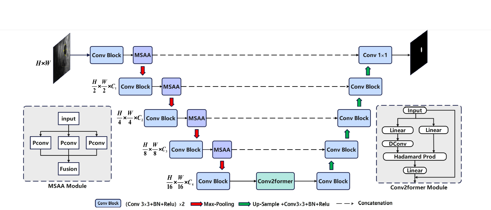

# PConv-UNet: Multi-Scale Pinwheel Convolutions for Breast Ultrasound Tumor Segmentation

Official Pytorch code for [PConv-UNet: Multi-Scale Pinwheel Convolutions for Breast
Ultrasound Tumor Segmentation]()

[Paper](https://www.sciencedirect.com/science/article/pii/S0141938225002896) | [Code](https://github.com/Scott0534/PConv-UNet)

[//]: # (**News** 🥰:)

[//]: # (- <font color="#dd0000" size="4">**CMU-Net advanced version can be found in [CMUNeXt]&#40;https://github.com/FengheTan9/CMUNeXt&#41;**</font> 🥰)

[//]: # (- <font color="#dd0000" size="4">**New benchmarks are available for fair comparison 😎: [url]&#40;https://github.com/FengheTan9/Medical-Image-Segmentation-Benchmarks&#41;**</font> 😘)

[//]: # ()


## Abstract
Breast tumor segmentation in ultrasound imaging is critical for early diagnosis and treatment planning. However, precise breast tumor segmentation still remains challenging, mainly due to varying sizes and irregular shapes. To address these challenges, we propose PConv-UNet, a novel U-shaped architecture that integrates multi-scale Pinwheel Convolutions (PConv) into UNet for Breast Ultrasound Tumor Segmentation. Specifically, we introduce Pinwheel convolution to capture the irregular shapes and texture variations in tumor boundaries through its multi-directional convolutional structure. Additionally, we design a multi-scale spatial adaptive attention (MSAA) module to handle tumors of different sizes by leveraging multi-scale features extracted by multiple pinwheel convolutions and a spatial attention mechanism. Furthermore, to enhance the network's ability to perceive tumors of different sizes and irregular shapes, we replace the bottleneck layers of traditional UNet with the Conv2Former module, a convolutional-Transformer architecture. The Conv2Former module uses large-sized convolutional kernels to expand the receptive field and employs a convolutional modulation mechanism to dynamically adjust feature weights, enabling simultaneous focus on local details and global context. This adaptive feature representation effectively models the irregular morphology of tumors and captures multi-scale information.
Extensive experiments demonstrate that our PConv-UNet achieves competitive performance compared to state-of-the-art breast tumor segmentation methods.  Ablation studies further confirm the effectiveness and complementary of each component in our PConv-UNet.


[//]: # (![msag]&#40;imgs/msag.png&#41;)

## Datasets

Please put the [BUSI](https://www.kaggle.com/aryashah2k/breast-ultrasound-images-dataset) dataset or your own dataset as the following architecture. 
```
├── CMUNet
    ├── inputs
        ├── BUSI
            ├── images
            |   ├── 0a7e06.jpg
            │   ├── 0aab0a.jpg
            │   ├── 0b1761.jpg
            │   ├── ...
            |
            └── masks
                ├── 0
                |   ├── 0a7e06.png
                |   ├── 0aab0a.png
                |   ├── 0b1761.png
                |   ├── ...
        ├── your dataset
            ├── images
            |   ├── 0a7e06.jpg
            │   ├── 0aab0a.jpg
            │   ├── 0b1761.jpg
            │   ├── ...
            |
            └── masks
                ├── 0
                |   ├── 0a7e06.png
                |   ├── 0aab0a.png
                |   ├── 0b1761.png
                |   ├── ...
```
## Environment

- Pytorch: 1.13.0 cuda 11.7
- cudatoolkit: 11.7.1
- scikit-learn: 1.0.2
- albumentation：1.2.0

[//]: # (## Training and Validation)

[//]: # (```)

[//]: # (python main.py --dataset BUSI --name CMUnet --img_ext .png --mask_ext .png --lr 0.0001 --epochs 300 --input_w 256 --input_h 256 --b 8)

[//]: # (```)

[//]: # ()
[//]: # (## Acknowledgements:)

[//]: # ()
[//]: # (This code-base uses helper functions from [UNeXt]&#40;https://github.com/jeya-maria-jose/UNeXt-pytorch&#41;.)

[//]: # ()
## Citation


If you use our code, please cite our paper:
```
@article{wang2025pconv,

  title={PConv-UNet: Multi-scale pinwheel convolutions for breast ultrasound tumor segmentation},

  author={Wang, Chen and Zhu, Yongbin and Wu, Rentingzhu and Shi, Fengyuan and Li, Qi and Liu, Weixiang and Hu, Keli},

  journal={Displays},

  pages={103252},

  year={2025},

  publisher={Elsevier}
}
```


